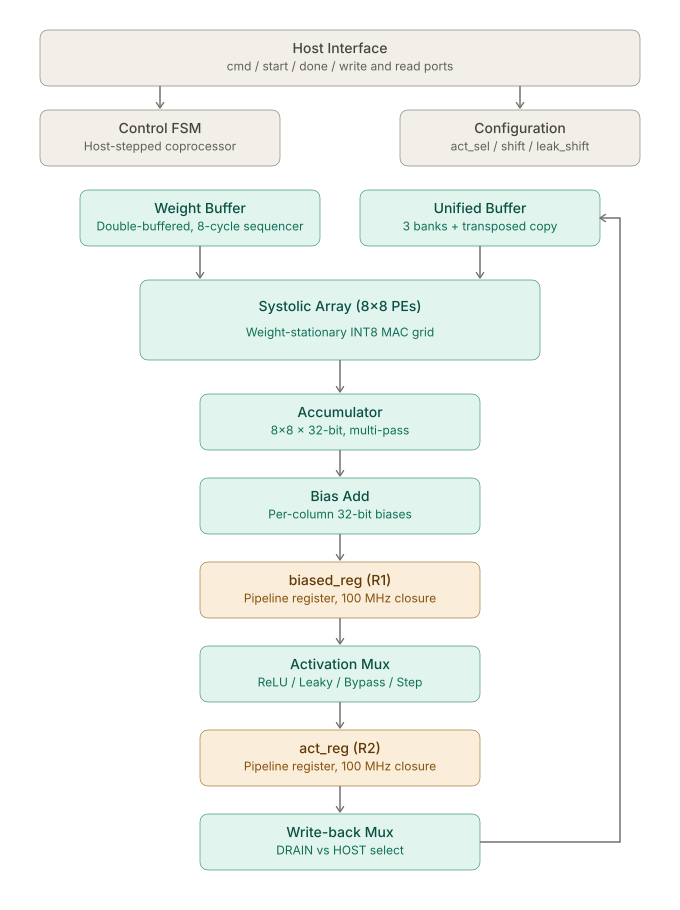

# 8×8 Systolic Array TPU Core

A weight-stationary 8×8 INT8 systolic array TPU core in SystemVerilog, taken from RTL through cocotb verification and deployed on FPGA with a benchmark against a PicoRV32 RISC-V baseline running the same MNIST inference workload on the same silicon.

Designed from first principles referencing the [Google TPU v1 paper](https://arxiv.org/abs/1704.04760).

---

## Headline Results

| Metric | Result |
|---|---|
| MNIST inference accuracy (FPGA, vs INT8 reference) | **100 / 100 bit-exact** |
| Cycles/sample, TPU (batch ×8) | 4,618 |
| Cycles/sample, PicoRV32 baseline (avg) | 5,353,626 |
| **Architectural speedup, batch / single** | **1,160× / 145×** |
| TPU per-sample cycle variance | **0 — fully data-independent** |
| Iris classification accuracy | 30 / 30 bit-exact (100%) |
| Post-route timing closure | 100 MHz, WNS +0.31 ns |
| Target board | Digilent Arty A7-100T |

The cycle ratio is the apples-to-apples architectural number — both designs were measured on the same FPGA, same 100 MHz clock, same INT8 quantization, same MNIST samples. The PicoRV32 baseline runs unmodified RV32I (no hardware multiply, software multiply via libgcc), making it the standard general-purpose CPU reference point.

The zero-variance result is structural, not coincidental: no data-dependent FSM branches, hardware multiply takes one cycle regardless of operand bits, and the EXEC count is determined entirely by network topology. For real-time inference workloads, predictable latency is often as valuable as low latency.

---

## Architecture





### Key design decisions

- **Weight-stationary dataflow** — weights pre-loaded into PEs before each compute pass; activations stream through column by column.
- **Host-stepped coprocessor FSM** — one primitive per `start` strobe (COMPUTE / DRAIN / STORE / CLEAR), returning to IDLE between commands. The host sequences layers externally; the FSM has no concept of neural networks, layer count, or tiling. The same hardware runs any compatible MLP without RTL modification.
- **Transposed copy in the unified buffer** — `active[r][c] <= write[c][r]` during COPY makes the array compute A × W consistently across layers, self-correcting the inherent transpose of the drain output for multi-layer feedback. One-line fix that eliminates per-layer transpose hardware.
- **Tiling via accumulate-on-write** — matrices larger than 8×8 are handled by multiple COMPUTE passes. The accumulator's first pass overwrites; subsequent passes accumulate. Host protocol is CLEAR → COMPUTE × N → DRAIN.
- **Two pipeline registers in `top.sv` for 100 MHz closure** — the drain path was split into three balanced ~5 ns stages with two new pipeline registers (`biased_reg`, `act_reg`). Submodule encapsulation was preserved: every edit lives at the integration layer. Cost was 4 cycles of additional drain latency per sample, recovered many times over by the higher clock.
- **Register file storage over SRAM macros** — keeps RTL portable across Yosys/OpenLane and Vivado flows without PDK-specific black-box instantiation.

---

## Module Breakdown

| Module | Description |
|--------|-------------|
| `pe.sv` | Single MAC. Signed INT8 × INT8 multiply, 32-bit accumulate. Registers `act_out` and `valid_out` to maintain systolic wavefront alignment. |
| `systolic_array.sv` | 8×8 PE grid. Per-column weight load strobe, internal activation stagger, valid propagation along the wavefront. |
| `weight_buffer.sv` | Double-buffered register file (shadow + active banks). Internal FSM: IDLE → COPY → SEQUENCE. Sequencer drives 8 columns of weights into the array over 8 cycles. |
| `unified_buffer.sv` | Three banks: write (host/feedback ingress), active (array input), result (host readback). Transposed copy on write→active for layer feedback. Per-row `valid` output. |
| `accumulator.sv` | 8×8 × 32-bit register file with per-column row counters for staggered wavefront capture. Multi-pass accumulation via `clear` and auto-reset on `pass_done`. Column-wise drain matching the unified buffer's write port. |
| `bias_add.sv` | 8 × 32-bit per-column bias registers. Combinational add in accumulator domain before requantization. |
| `relu.sv` `leaky_relu.sv` `bypass.sv` `binary_step.sv` | Combinational activation units. Configurable arithmetic right-shift for requantization, clamp to INT8. Selected by 2-bit `act_sel` mux at the integration layer. |
| `control_fsm.sv` | 8-state host-stepped FSM. Pure state-decode trigger outputs; `done` derived combinationally from the state transition into IDLE. |
| `top.sv` | Integration wrapper. Wires all submodules, hosts the activation mux, holds the two drain-path pipeline registers and the 2-cycle `drain_done` delay line that aligns the FSM with the new pipeline depth. |

---

## Verified Inference

### Iris (4 → 8 → 3 MLP)

- Trained in PyTorch with bias and leaky ReLU (α = 0.125), quantized to INT8 via symmetric per-tensor quantization.
- INT8 reference accuracy: 100% (30/30).
- Hardware accuracy: **30/30 bit-exact** vs the INT8 reference, 100% classification accuracy.
- Single-tile inference — the network fits in one 8×8 pass per layer, no accumulator tiling required.

### MNIST (784 → 64 → 10 MLP)

- Float accuracy 97.4%, INT8 accuracy 97.2% on the full 10k test set.
- Tiled inference: layer 1 = 98 inner passes × 8 column groups = 784 COMPUTEs/sample; layer 2 = 16 COMPUTEs/sample.
- Hardware accuracy: **100/100 bit-exact** on the 100-sample test subset.
- Batching: 8 samples fill all 8 array rows simultaneously, achieving 7.69× per-sample cycle reduction with zero RTL changes.

### Reference verification

Every hardware result is checked bit-exact against an integer-only Python reference model that mirrors the hardware datapath: matmul → bias add → arithmetic right shift → activation → saturate. Bit-exactness is the credibility floor for the cycle-ratio claim — a faster wrong answer is worth nothing.

---

## FPGA Implementation

The TPU core was deployed on a Digilent Arty A7-100T (Xilinx Artix-7) running at 100 MHz, with a UART host interface, an on-chip BRAM weight subsystem, and a PicoRV32 RISC-V SoC built as the comparison baseline.

The FPGA-specific RTL is **not included in this repository** — it is tightly coupled to the Arty A7-100T pinout and clock topology, and the portfolio value is in the engineering decisions, not in providing a turnkey bitstream for one specific board. Readers who want to reproduce the work on their own board have enough information from the writeup below to do so without inheriting the board-specific files.

The full bring-up story is in [`docs/fpga_bringup.md`](docs/fpga_bringup.md), covering:

- **100 MHz timing closure.** Identifying the critical path on the drain (24 logic levels, ~14.5 ns combinational) from the post-route STA report, splitting it into three balanced ~5 ns stages with two pipeline registers in `top.sv`, and the 2-cycle delay line on `drain_done` required to keep the FSM aligned with the new pipeline depth. WNS went from −4.5 ns (failing) to +0.31 ns (closed) without modifying any submodule.
- **On-chip BRAM weight subsystem.** An asymmetric dual-port BRAM (64 KB, byte-write / 64-bit read) plus an autonomous `weight_loader` that fills the weight buffer in 10 cycles. Weights upload once at boot via a `WRITE_WEIGHT_BULK` opcode; per-tile loads then become 4-byte commands instead of 8-frame UART bursts. 22× reduction in weight-path UART traffic, 1.68× wall-clock speedup on MNIST.
- **PicoRV32 baseline SoC.** Vendored upstream `picorv32.v` (RV32I, no hardware multiply — the standard general-purpose CPU reference), 128 KB unified BRAM, memory-mapped UART, `RDCYCLE`-based per-sample cycle measurement.

---

## Benchmark

### Methodology

Both designs run on the same Arty A7-100T at 100 MHz, communicate via the same UART protocol shape, process identical INT8-quantized MNIST samples, and produce bit-exact predictions verified against the Python integer reference. Cycles are measured between idle-to-idle FSM transitions on the TPU side, and between `RDCYCLE` reads bracketing the inference call on the CPU side — the comparison excludes UART overhead on both sides so the architectural ratio is not contaminated by host-protocol design choices.

### Results (MNIST, 100 samples)

| | TPU (single mode) | TPU (batch ×8) | PicoRV32 |
|---|---|---|---|
| Bit-exact accuracy | 100% | 100% | 100% |
| Avg cycles / sample | 36,940 | **4,618** | 5,353,626 |
| Min / max cycles | 36,940 / 36,940 | 36,940 / 36,940 | 4.4M / 6.7M |
| Cycle variance | 0 | **0** | ±1.2M |
| Compute time @ 100 MHz | 0.37 ms | **0.046 ms** | 53.5 ms |
| Speedup vs PicoRV32 | 145× | **1,160×** | 1× |

### Why the variance comparison matters

The PicoRV32's ±1.2M cycle spread is not algorithmic — it's `__mulsi3`, libgcc's shift-and-add software multiply, iterating conditionally on the operand bit-pattern. With 51,200 multiplies per sample, operand-dependent execution time accumulates into substantial variance. A hardware-multiply CPU (`ENABLE_MUL=1`) would collapse this. The point of the comparison is what naive RV32I looks like as a baseline, not what an optimized embedded CPU could do.

The TPU's zero variance, by contrast, is structural and survives any operand input. This is a property of the design, not a measurement coincidence.

### Wall-clock vs cycle-count

Wall-clock per-sample numbers diverge from the cycle ratio because UART round-trip latency dominates the TPU's wall-clock. The TPU performs many small per-tile transactions (one EXEC per inner pass, one LOAD_WEIGHT_TILE per tile group), each costing tens of milliseconds in USB-stack round trip, while the CPU does a single large inference round trip per sample. This is Amdahl's Law in an I/O-bound system — the systolic array is faster at the math, but per-tile protocol overhead can hide the gap at the wall-clock level. The architectural number is the cycle ratio; the wall-clock number reflects the host-protocol design, not the silicon.

---

## Toolchain

| Tool | Purpose |
|------|---------|
| SystemVerilog | RTL implementation |
| Verilator 5.x | Simulation (`--binary --timing -Wall -Wno-fatal --trace --trace-structs`) |
| cocotb 2.0 + NumPy | Python testbenches with floating-point reference models |
| GTKWave | Waveform inspection |
| Yosys 0.64 (OSS CAD Suite) | Logic synthesis, native SystemVerilog support |
| OpenSTA + sky130 PDK | Static timing analysis on synthesized netlist |
| Vivado | FPGA synthesis, place-and-route, post-route STA |
| RISC-V GCC (rv32i, ilp32) | PicoRV32 firmware compilation |
| PyTorch | Network training and INT8 quantization |
| pyserial | Host-side UART driver for FPGA inference |

---

## Running Simulations

Each module has an independent cocotb testbench. Example:

```bash
cd tb/systolic_array
make
```

Requires Verilator 5.x and cocotb 2.0. Waveforms are written to `dump.vcd`, viewable in GTKWave.

End-to-end inference tests:

```bash
cd tb/top/Iris && make            # Iris  — 30/30 bit-exact
cd tb/top/MNIST && make           # MNIST — 100/100 bit-exact
```

The `host_script/` and `firmware/` directories show how the FPGA system is exercised end-to-end. Running them requires the FPGA-side bitstream, which is not included in this repository for the reasons discussed in the FPGA Implementation section above.

---

## Background & Motivation

This project is a personal portfolio piece demonstrating end-to-end RTL design competency — architecture, verification, ASIC synthesis, FPGA bring-up, and benchmarking — rather than any single phase in isolation. The goal was a programmable, model-agnostic accelerator: weights load at runtime, the same hardware runs any compatible MLP without RTL modification.

Every architectural decision traces back to a reason. Where the design diverges from the original TPU paper (transposed copy for layer feedback, host-stepped FSM rather than internal layer logic, register-file storage for portability), the rationale is documented either in the design notes or in [`docs/fpga_bringup.md`](docs/fpga_bringup.md).

---

## References

- Jouppi et al., *In-Datacenter Performance Analysis of a Tensor Processing Unit*, ISCA 2017 — [arXiv:1704.04760](https://arxiv.org/abs/1704.04760)
- [PicoRV32](https://github.com/YosysHQ/picorv32) — RV32I CPU core used for the comparison baseline (YosysHQ, MIT-licensed)
- [SkyWater 130nm PDK](https://github.com/google/skywater-pdk) — open-source PDK targeted for ASIC synthesis
- [OSS CAD Suite](https://github.com/YosysHQ/oss-cad-suite-build) — pre-built Yosys / sv2v / OpenSTA bundle
